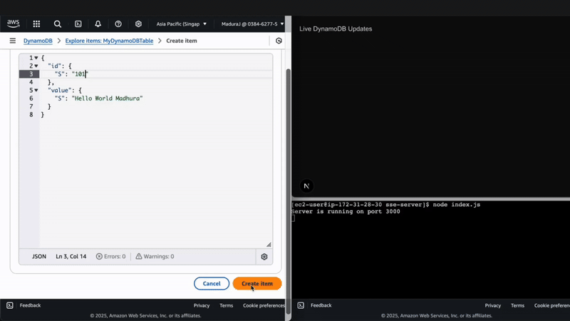

# Real-Time DynamoDB Stream Updates with AWS Lambda, EC2, and Next.js

## Overview

This repository demonstrates a real-time data streaming system using **AWS DynamoDB Streams, AWS Lambda, EC2 (Node.js SSE Server), and Next.js Frontend**. When data changes in DynamoDB, AWS Lambda triggers an event that updates an EC2-based backend. The backend then pushes live updates to a Next.js frontend via **Server-Sent Events (SSE)**.

### 🔥 Key Features:
- **Real-Time Streaming**: Updates in DynamoDB are streamed directly to the frontend.
- **AWS Lambda Trigger**: Automatically processes new DynamoDB records.
- **Node.js SSE Server**: Runs on an EC2 instance and pushes live updates.
- **Next.js Frontend**: Displays real-time updates from the backend.

---

## 🏗 Architecture

1. **DynamoDB Table**: Stores real-time data.
2. **DynamoDB Streams**: Captures changes in the table.
3. **AWS Lambda**: Processes stream events and sends updates to EC2.
4. **EC2 Node.js Server**: Acts as an SSE server for real-time updates.
5. **Next.js Frontend**: Connects to SSE and displays live data.

## 🏗 Architecture Flow

Here’s an overview of how real-time updates flow through the system:

---

## 🎥 Real-Time Streaming Demo

Check out the real-time data flow in action:

---

## 📝 Read More on Medium

For a detailed breakdown, check out my Medium article:  

📖 **[Read the Full Article Here](https://medium.com/@madhurajayashanka/real-time-dynamodb-stream-updates-with-aws-lambda-ec2-and-next-js-frontend-b4296540ba82)**  
